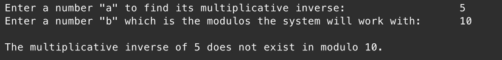

# README: Multiplicative Inverse Finder

### Program Title:
Multiplicative Inverse in a Modular System

### Author:
Zainab Abdali ID: 202005678   
Osama Alansari ID: 202103778  
Course: Network Security 2 (ITNE361)  
Instructor: Dr. Ebrahim Janahi  
Due Date: October 24th, 2024

---

## 1. Program Description:
This Python program is designed to calculate the **multiplicative inverse** of a number `a` in a modular system with modulus `b`. It implements the **Extended Euclidean Algorithm** to compute the inverse. If the multiplicative inverse exists(the two inputs are co-prime), it outputs the inverse; otherwise, it notifies the user that no inverse exists for the given inputs.

---

## 2. How to Run the Program:

### Requirements:
- Python 3.x must be installed on your system.
- No external libraries are required.

### Instructions for Running:
1. Open a terminal or command prompt.
2. Navigate to the directory where the program is saved.
3. Run the program using the following command:
   ```bash
   python3 multiplicative_inverse.py
---
## Simple Input/Output

### Example 1:


### Example 2:


### Example 3:


### Example 4:


